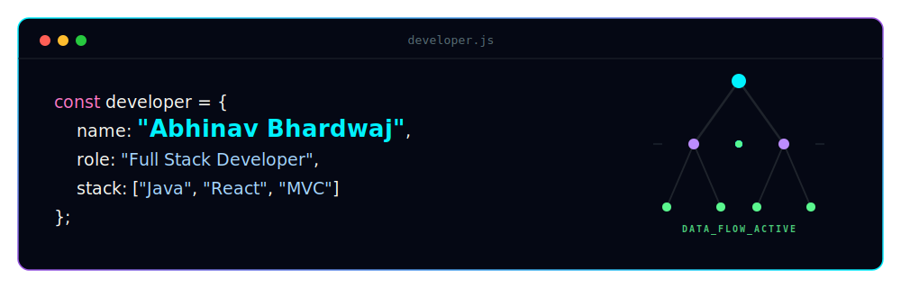

  

<h1 align="center">Abhinav Bhardwaj</h1>

Full-Stack Developer &amp; Product Analyst

  
  
  

  

---

## About Me

I am a software developer focused on building scalable web applications and evaluating digital products. I combine solid backend foundations with modern frontend technologies and an eye for user experience.

- **Current Focus:** Full-stack web applications and UI/UX improvements.
- **Core Technologies:** Java (MVC, Spring Boot) and React.
- **Interests:** Algorithms, system design, and software architecture.
- **Analytical Work:** Deconstructing digital products (such as my Netflix teardown project) to explore product strategy and system design.

---

## Tech Stack

### Languages & Core

  
  
  
  
  

### Frameworks & Libraries

  
  
  

### Tools & Platforms

  
  
  
  

---

## GitHub Analytics

  
  

  

---

## Featured Projects

Here are some of the key projects in my development journey:

| Project | Description | Tech Stack | Link |
| :--- | :--- | :--- | :---: |
| **CS-Netflix** | Product teardown, UX review, and engineering analysis of Netflix. | Product Teardown, UI/UX Analysis | [View Repo](https://github.com/1AbhinavBhardwaj/CS-Netflix) |
| **Loan Management** | Modern user dashboard for requesting, tracking, and managing loan applications. | React, JavaScript, CSS | [View Repo](https://github.com/1AbhinavBhardwaj/Loan-management-system) |
| **AI Directory Manager** | Intelligent file organization tool using machine learning to categorize and manage files. | Python, PyQt5, ML (BERT/LSTM) | [View Repo](https://github.com/1AbhinavBhardwaj/AI-Directory-Management-System) |
| **Wellbeing Intelligence** | Evaluation and tracking platform for student academic performance, attendance, and burnout metrics. | Java, SQL, Maven | [View Repo](https://github.com/1AbhinavBhardwaj/Student-Performance---Wellbeing-Intelligence-System) |
| **Subscription Box** | Scalable service backend managing subscriber boxes, shipping cycles, and accounts. | Java, MVC, OOP Principles | [View Repo](https://github.com/1AbhinavBhardwaj/Subscription-Box-Service) |
| **LeetCode Solutions** | Curated collection of optimized data structure and algorithm solutions. | Java, DSA, Problem Solving | [View Repo](https://github.com/1AbhinavBhardwaj/leetcode) |

---

  

